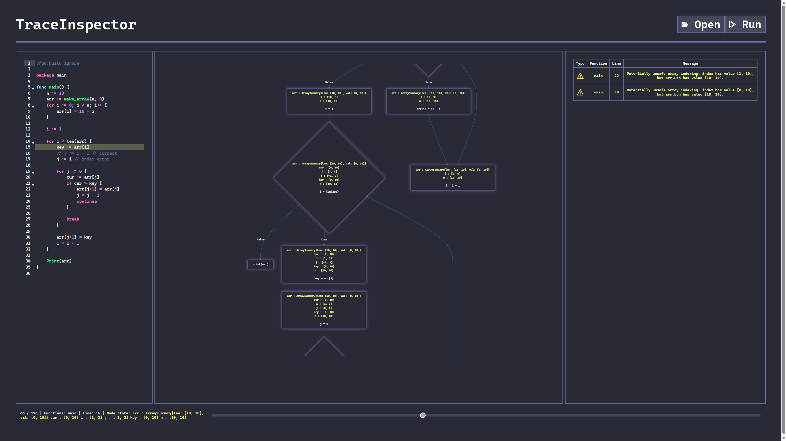

# TraceInspector

추적 가능한 시각화 기반 코드 정적분석기

Capstone team 2: 김신영, 강민성

## Introduction

정적 분석기는 현재 개발의 많은 방면에서 활용되고 있습니다. 여러 IDE에 기본으로 탑재되어 있고 CI/CD 단계에서도 잠재적인 버그 탐지를 위해 채용되고 있습니다.

하지만 단순하게 결과를 활용하였을 때보단 분석 과정 및 동작 원리에 대한 이해가 되었을 경우 유효한 오류인지 보다 정확하게 판별할 수 있고, 코드의 실행 흐름에 대해 보다 잘 이해할 수 있게 됩니다.

TraceInspector는 요약해석(abstract interpretation)이론을 바탕으로 Go언어로 작성된 프로그램에 대해 각 프로그램 지점별 상태를 근사하는 분석기와 근사 과정을 단계별로 시각화하여 나타내는 인터페이스로 구성되어 있습니다.

알고리즘과 자료구조를 공부할 때 실제 알고리즘의 동작 원리를 단계적으로 그림을 그려보며 따라가면 이해가 더 잘 되듯이, TraceInspector 역시 정적 프로그램 분석 알고리즘에 대한 이해와 접근성을 초점으로 구성된 서비스입니다.

## Usage

Open을 눌러 분석하고자 하는 Go 소스 프로그램을 업로드 후, Run을 눌러 분석을 수행합니다. 좌측에는 입력 프로그램의 소스, 가운데는 프로그램의 계산 그래프 표현, 우측에는 분석 중 발생한 정보 및 경보와 오류가 표시됩니다.

TraceInspector는 상술했듯이 단순히 경보만 출력하고 종료되지 않습니다. 하단의 슬라이더를 통해 분석 알고리즘이 어떤 절차를 따라서 프로그램의 실행 상태를 추정했는지 단계별로 따라갈 수 있습니다. 가운데 계산 그래프에 각 프로그램 지점별로 계산된 상태 근사값이 표현되고, 슬라이더를 통해 추정된 상태값이 알고리즘이 동작함에 따라 어떻게 변하는지 확인할 수 있습니다.

우측 창은 입력 소스에서 잠재적으로 발생할 수 있는 경보나, 분석 중 오류가 발생한 경우 해당 정보를 출력합니다. 

TraceInspector는 요약해석 이론에 따라 프로그램 상태에 대한 *보수적인* 근사를 계산합니다. 즉 실제로는 계산되지 않을 값이나 실행 경로를 반영하여 허위 경보를 표출할 수 있습니다. 하지만 실행 가능한 *모든* 프로그램 경로를 항상 반영하기에, 오류가 발생하지 않는다고 판정될 경우 실제 실행 시 오류가 발생하지 않음이 수학적으로 보장됩니다.
