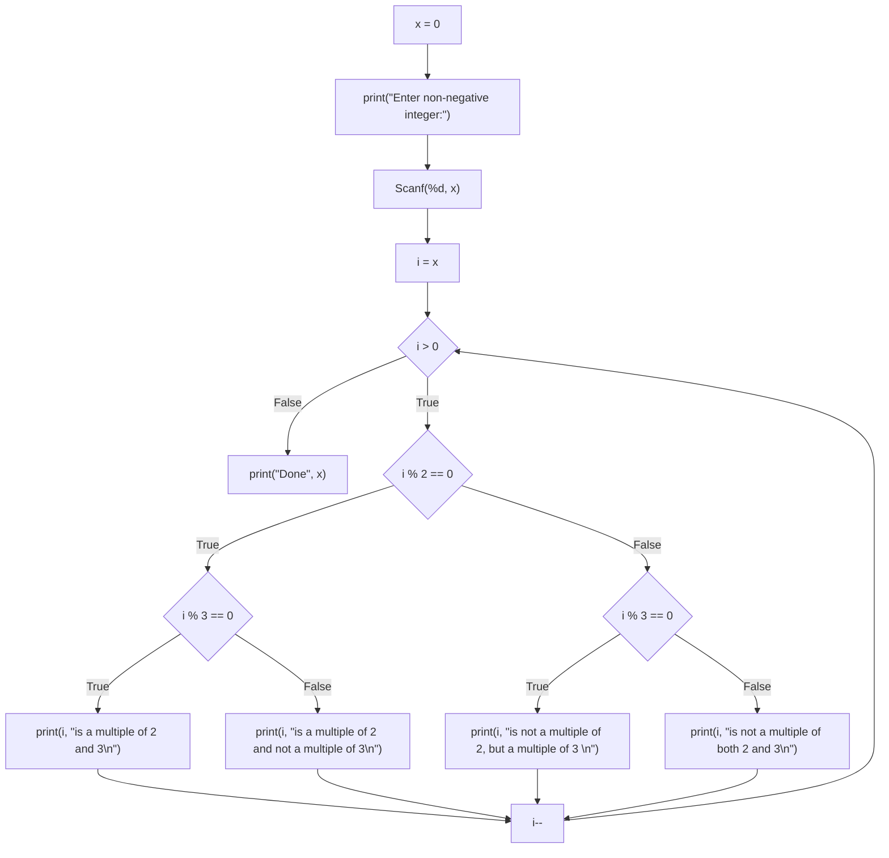

# TraceInspector 
# analyzer executable 입출력 형식

출력 종류:

1. CFG JSON으로 출력: `./traceinspector --gofile input.go --print-cfg-json` 로 호출. 코드에 대응되는 그래프의 정점과 간선 정보 출력. 정점에 대응되는 코드 줄 번호를 입력하여 정점을 클릭하거나 코드 줄을 클릭하면 서로 하이라이트 되게끔 구현.
2. CFG Mermaid로 출력: `./traceinspector --gofile input.go --print-cfg-mermaid` 로 호출. JSON형태와 동등한 그래프를 Mermaid 코드로 출력.
3. Go -> Imp 번역: `./traceinspector --gofile input.go --print-imp` 로 호출. 입력 Go 코드에 대응되는 Imp 코드 출력.
4. Go -> Imp 번역 후 실행: `./traceinspector --gofile input.go --interpret-imp` 로 호출. 입력 Go 코드에 대응되는 Imp 코드 생성 후 실행(interpretation).


## 종류별 출력 예시

`node_type` :
- "basic" (사각형)
- "cond" (마름모)

### Input code

```go
//go:build ignore

package main

import "fmt"

func main() {
	x := 0
	fmt.Print("Enter non-negative integer:")
	fmt.Scanf("%d", x)
	for i := x; i > 0; i-- {
		if i%2 == 0 {
			if i%3 == 0 {
				fmt.Print(i, "is a multiple of 2 and 3\n")
			} else {
				fmt.Print(i, "is a multiple of 2 and not a multiple of 3\n")
			}
		} else if i%3 == 0 {
			fmt.Print(i, "is not a multiple of 2, but a multiple of 3 \n")
		} else {
			fmt.Print(i, "is not a multiple of both 2 and 3\n")
		}
	}
	fmt.Print("Done", x)
}
```

### CFG JSON Format

generates a CFG graph for every function defined in the file.

```
{
    "main": {
        "Nodes": [
            {
                "Id": 1,
                "Code": "print(#34;Done#34;, x)",
                "Node_type": "basic",
                "Line_num": 24
            },
            {
                "Id": 2,
                "Code": "i > 0",
                "Node_type": "cond",
                "Line_num": 11
            },
            {
                "Id": 3,
                "Code": "i--\n",
                "Node_type": "basic",
                "Line_num": 11
            },
            {
                "Id": 4,
                "Code": "i % 2 == 0",
                "Node_type": "cond",
                "Line_num": 12
            },
            {
                "Id": 5,
                "Code": "i % 3 == 0",
                "Node_type": "cond",
                "Line_num": 13
            },
            {
                "Id": 6,
                "Code": "print(i, #34;is a multiple of 2 and 3\\n#34;)",
                "Node_type": "basic",
                "Line_num": 14
            },
            {
                "Id": 7,
                "Code": "print(i, #34;is a multiple of 2 and not a multiple of 3\\n#34;)",
                "Node_type": "basic",
                "Line_num": 16
            },
            {
                "Id": 8,
                "Code": "i % 3 == 0",
                "Node_type": "cond",
                "Line_num": 18
            },
            {
                "Id": 9,
                "Code": "print(i, #34;is not a multiple of 2, but a multiple of 3 \\n#34;)",
                "Node_type": "basic",
                "Line_num": 19
            },
            {
                "Id": 10,
                "Code": "print(i, #34;is not a multiple of both 2 and 3\\n#34;)",
                "Node_type": "basic",
                "Line_num": 21
            },
            {
                "Id": 11,
                "Code": "i = x",
                "Node_type": "basic",
                "Line_num": 11
            },
            {
                "Id": 12,
                "Code": "Scanf(%d, x)",
                "Node_type": "basic",
                "Line_num": 10
            },
            {
                "Id": 13,
                "Code": "print(#34;Enter non-negative integer:#34;)",
                "Node_type": "basic",
                "Line_num": 9
            },
            {
                "Id": 14,
                "Code": "x = 0",
                "Node_type": "basic",
                "Line_num": 8
            }
        ],
        "Edges": [
            {
                "Id": 0,
                "From_node_id": 3,
                "To_node_id": 2,
                "Label": ""
            },
            {
                "Id": 1,
                "From_node_id": 6,
                "To_node_id": 3,
                "Label": ""
            },
            {
                "Id": 2,
                "From_node_id": 7,
                "To_node_id": 3,
                "Label": ""
            },
            {
                "Id": 3,
                "From_node_id": 5,
                "To_node_id": 6,
                "Label": "True"
            },
            {
                "Id": 4,
                "From_node_id": 5,
                "To_node_id": 7,
                "Label": "False"
            },
            {
                "Id": 5,
                "From_node_id": 9,
                "To_node_id": 3,
                "Label": ""
            },
            {
                "Id": 6,
                "From_node_id": 10,
                "To_node_id": 3,
                "Label": ""
            },
            {
                "Id": 7,
                "From_node_id": 8,
                "To_node_id": 9,
                "Label": "True"
            },
            {
                "Id": 8,
                "From_node_id": 8,
                "To_node_id": 10,
                "Label": "False"
            },
            {
                "Id": 9,
                "From_node_id": 4,
                "To_node_id": 5,
                "Label": "True"
            },
            {
                "Id": 10,
                "From_node_id": 4,
                "To_node_id": 8,
                "Label": "False"
            },
            {
                "Id": 11,
                "From_node_id": 2,
                "To_node_id": 4,
                "Label": "True"
            },
            {
                "Id": 12,
                "From_node_id": 2,
                "To_node_id": 1,
                "Label": "False"
            },
            {
                "Id": 13,
                "From_node_id": 11,
                "To_node_id": 2,
                "Label": ""
            },
            {
                "Id": 14,
                "From_node_id": 12,
                "To_node_id": 11,
                "Label": ""
            },
            {
                "Id": 15,
                "From_node_id": 13,
                "To_node_id": 12,
                "Label": ""
            },
            {
                "Id": 16,
                "From_node_id": 14,
                "To_node_id": 13,
                "Label": ""
            }
        ]
    }
}
```

### CFG Mermaid format



```
fun main() none {
        x = 0
        print("Enter non-negative integer:")
        Scanf(%d, x)
        i = x
        while i > 0 {
                if i % 2 == 0 {
                        if i % 3 == 0 {
                                print(i, "is a multiple of 2 and 3\n")
                        } else {
                                print(i, "is a multiple of 2 and not a multiple of 3\n")
                        }

                } else {
                        if i % 3 == 0 {
                                print(i, "is not a multiple of 2, but a multiple of 3 \n")
                        } else {
                                print(i, "is not a multiple of both 2 and 3\n")
                        }

                }

                i--

        }

        print("Done", x)
}
```

### Imp Code output
