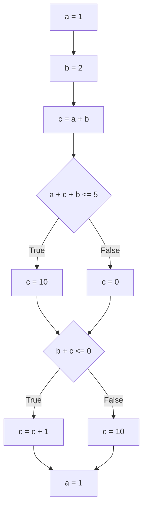

# TraceInspector 
# analyzer executable 입출력 형식

출력 종류:

1. CFG JSON으로 출력: `./traceinspector --gofile input.go --print-cfg-json` 로 호출. 코드에 대응되는 그래프의 정점과 간선 정보 출력. 정점에 대응되는 코드 줄 번호를 입력하여 정점을 클릭하거나 코드 줄을 클릭하면 서로 하이라이트 되게끔 구현.
2. CFG Mermaid로 출력: `./traceinspector --gofile input.go --print-cfg-mermaid` 로 호출. JSON형태와 동등한 그래프를 Mermaid 코드로 출력.
3. Go -> Imp 번역: `./traceinspector --gofile input.go --print-imp` 로 호출. 입력 Go 코드에 대응되는 Imp 코드 출력.
4. Go -> Imp 번역 후 실행: `./traceinspector --gofile input.go --interpret-imp` 로 호출. 입력 Go 코드에 대응되는 Imp 코드 생성 후 실행(interpretation).
5. Go -> Imp 번역 후 분석: `./traceinspector --gofile input.go`


## 종류별 출력 예시

`node_type` :
- "basic" (사각형)
- "cond" (마름모)

### Input code

```go
//go:build ignore

package main

import "fmt"

func main() {
	x := 0
	fmt.Print("Enter non-negative integer:")
	fmt.Scanf("%d", x)
	for i := x; i > 0; i-- {
		if i%2 == 0 {
			if i%3 == 0 {
				fmt.Print(i, "is a multiple of 2 and 3\n")
			} else {
				fmt.Print(i, "is a multiple of 2 and not a multiple of 3\n")
			}
		} else if i%3 == 0 {
			fmt.Print(i, "is not a multiple of 2, but a multiple of 3 \n")
		} else {
			fmt.Print(i, "is not a multiple of both 2 and 3\n")
		}
	}
	fmt.Print("Done", x)
}
```

### CFG JSON Format

generates a CFG graph for every function defined in the file.

```
{
    "main": {
        "Nodes": [
            {
                "Id": 2,
                "Code": "b + c \u003c= 0",
                "Node_type": "cond",
                "Line_num": 15
            },
            {
                "Id": 3,
                "Code": "c = c + 1",
                "Node_type": "basic",
                "Line_num": 16
            },
            ...
        ],
        "Edges": [
            {
                "Id": 0,
                "From_node_loc": 3,
                "To_node_loc": 1,
                "Label": ""
            },
            {
                "Id": 1,
                "From_node_loc": 4,
                "To_node_loc": 1,
                "Label": ""
            },
            {
                "Id": 2,
                "From_node_loc": 2,
                "To_node_loc": 3,
                "Label": "True"
            },
            ...
        ]
    }
}
```

### CFG Mermaid format

#### main



### Imp Code output

```
fun partition(a ArrayType<int>, lo int, hi int) int {
	pivot = a[hi]
	i = lo
	j = lo
	while j < hi {
		if a[j] < pivot {
			tmp = a[i]
			a[i] = a[j]
			a[j] = tmp
			i = i + 1
		} else {

		}
		j = j + 1
	}
	tmp = a[i]
	a[i] = a[hi]
	a[hi] = tmp
	return i
}

fun quicksort(a ArrayType<int>, lo int, hi int) ArrayType<int> {
	if lo >= hi {
		return a
	} else {

	}
	p = partition(a, lo, hi)
	quicksort(a, lo, p - 1)
	quicksort(a, p + 1, hi)
	return a
}

fun main() none {
	n = 0
	Scanf(%d, n)
	arr = make_array(n, 0)
	i = 0
	while i < n {
		x = 0
		Scanf(%d, x)
		arr[i] = x
		i++
	}
	print(quicksort(arr, 0, n - 1), "\n")
}
```

## 분석 결과 출력

### 예시:
```
{"Type":"update_node","Function_name":"main","Node_id":10,"Node_state":"{}","Msg":"Join global memory state"}
{"Type":"update_node","Function_name":"main","Node_id":5,"Node_state":"{c : [3, 3], a : [1, 1], b : [2, 2]}","Msg":"Join global memory state"}
{"Type":"warning","Function_name":"main","Node_id":5,"Node_state":"","Msg":"Could not represent 'a + c + b <= 5' as SimpleProp. Analysis precision may severely deterioriate."}
{"Type":"update_node","Function_name":"main","Node_id":6,"Node_state":"{b : [2, 2], c : [3, 3], a : [1, 1]}","Msg":"Join global memory state"}
{"Type":"info","Function_name":"main","Node_id":7,"Node_state":"","Msg":"No updates to node state"}
{"Type":"update_node","Function_name":"main","Node_id":4,"Node_state":"{c : [10, 10], a : [1, 1], b : [2, 2]}","Msg":"Join global memory state"}
{"Type":"update_node","Function_name":"main","Node_id":3,"Node_state":"{a : [1, 1], b : ⊥, c : ⊥}","Msg":"Join global memory state"}
{"Type":"info","Function_name":"main","Node_id":4,"Node_state":"","Msg":"No updates to node state"}
{"Type":"update_node","Function_name":"main","Node_id":3,"Node_state":"{b : ⊥, c : ⊥, a : [1, 1]}","Msg":"Join global memory state"}
{"Type":"update_node","Function_name":"main","Node_id":4,"Node_state":"{c : [0, 10], a : [1, 1], b : [2, 2]}","Msg":"Join global memory state"}
{"Type":"update_node","Function_name":"main","Node_id":3,"Node_state":"{a : [1, 1], b : ⊥, c : ⊥}","Msg":"Join global memory state"}
{"Type":"info","Function_name":"main","Node_id":4,"Node_state":"","Msg":"No updates to node state"}
{"Type":"update_node","Function_name":"main","Node_id":1,"Node_state":"{b : ⊥, c : ⊥, a : [1, 1]}","Msg":"Join global memory state"}
{"Type":"info","Function_name":"main","Node_id":1,"Node_state":"","Msg":"No updates to node state"}

```

- `Type`: 이벤트 종류
    - `info`: 정보 출력. `Function_name, Node_id` 위치의 노드 실행중 메시지 `Msg` 발생. 정보창에 띄울것.
    - `warning`: 워닝(오류 아님). `info`와 형식 동일함. 대신 워닝 띄우기. 오류와는 다르게 계속 실행함.
    - `error`: 분석 진행이 불가능한 오류. `info`와 형식 동일. 오류가 발생하면 분석 종료됨(마지막 이벤트).
    - `update_node`: `Function_name, Node_id` 위치의 노드 상태를 `Node_data`의 값으로 갱신. 동시에 정보창에 `Msg` 설명을 표시할 것(왜 이런 업데이트가 발생했는지에 대한 설명). 슬라이더에 들어가는 단위.
- `Function_name`: 노드의 함수 이름. 
- `Node_id`: 함수 내에서 노드 번호. 노드 번호가 0이면 존재하지 않는 노드임.
- `Node_data`: `update_node` 이벤트 발생시 해당 노트의 상태를 이 속성의 텍스트로 변경할 것. 다른 이벤트에는 빈 스트링임.
- `Msg`: 정보창에 띄울 정보.
