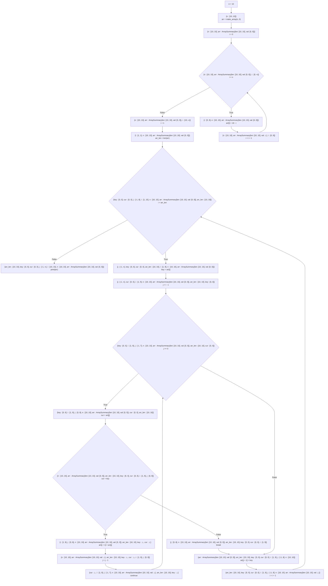

```mermaid
---
config:
    "markdownAutoWrap": false
---
flowchart TD
7{"`{n : [10, 10], arr : ArraySummary{len: [10, 10], val: [0, 0]}, arr_len : [10, 10], key : [0, 0], cur : [0, 0], i : [1, 9], j : [0, 8]}
cur > key`"}

16{"`{n : [10, 10], arr : ArraySummary{len: [10, 10], val: [0, 0]}, i : [0, ∞]}
i < n`"}

17["`{n : [10, 10], arr : ArraySummary{len: [10, 10], val: ⊥}, i : [0, 9]}
i = i + 1`"]

1["`{arr_len : [10, 10], key : [0, 0], cur : [0, 0], j : [-1, ∞], i : [10, 10], n : [10, 10], arr : ArraySummary{len: [10, 10], val: [0, 0]}}
print(arr)`"]

2{"`{key : [0, 0], cur : [0, 0], j : [-1, 8], i : [1, 10], n : [10, 10], arr : ArraySummary{len: [10, 10], val: [0, 0]}, arr_len : [10, 10]}
i < arr_len`"}

3["`{arr_len : [10, 10], key : [0, 0], cur : [0, 0], i : [1, 9], j : [-1, 8], n : [10, 10], arr : ArraySummary{len: [10, 10], val: ⊥}}
i = i + 1`"]

8["`{cur : ⊥, i : [1, 9], j : [-1, 7], n : [10, 10], arr : ArraySummary{len: [10, 10], val: ⊥}, arr_len : [10, 10], key : ⊥}
continue`"]

12["`{j : [-1, ∞], cur : [0, 0], i : [1, 9], n : [10, 10], arr : ArraySummary{len: [10, 10], val: [0, 0]}, arr_len : [10, 10], key : [0, 0]}
j = i - 1`"]

15["`{n : [10, 10], arr : ArraySummary{len: [10, 10], val: [0, 0]}, i : [10, ∞]}
i = 1`"]

18["`{i : [0, 9], n : [10, 10], arr : ArraySummary{len: [10, 10], val: [0, 0]}}
arr[i] = 10 - i`"]

19["`{n : [10, 10], arr : ArraySummary{len: [10, 10], val: [0, 0]}}
i = 0`"]

10["`{i : [1, 9], j : [0, 8], n : [10, 10], arr : ArraySummary{len: [10, 10], val: [0, 0]}, arr_len : [10, 10], key : ⊥, cur : ⊥}
arr[j + 1] = arr[j]`"]

11["`{key : [0, 0], i : [1, 9], j : [0, 8], n : [10, 10], arr : ArraySummary{len: [10, 10], val: [0, 0]}, cur : [0, 0], arr_len : [10, 10]}
cur = arr[j]`"]

14["`{i : [1, 1], n : [10, 10], arr : ArraySummary{len: [10, 10], val: [0, 0]}}
arr_len = len(arr)`"]

20["`{n : [10, 10]}
arr = make_array(n, 0)`"]

21["`n = 10`"]

4["`{arr : ArraySummary{len: [10, 10], val: [0, 0]}, arr_len : [10, 10], key : [0, 0], cur : [0, 0], i : [1, 9], j : [-1, 8], n : [10, 10]}
arr[j + 1] = key`"]

5{"`{key : [0, 0], i : [1, 9], j : [-1, 7], n : [10, 10], arr : ArraySummary{len: [10, 10], val: [0, 0]}, arr_len : [10, 10], cur : [0, 0]}
j >= 0`"}

9["`{n : [10, 10], arr : ArraySummary{len: [10, 10], val: ⊥}, arr_len : [10, 10], key : ⊥, cur : ⊥, i : [1, 9], j : [0, 8]}
j = j - 1`"]

13["`{j : [-1, ∞], key : [0, 0], cur : [0, 0], arr_len : [10, 10], i : [1, 9], n : [10, 10], arr : ArraySummary{len: [10, 10], val: [0, 0]}}
key = arr[i]`"]

6["`{j : [0, 8], n : [10, 10], arr : ArraySummary{len: [10, 10], val: [0, 0]}, arr_len : [10, 10], key : [0, 0], cur : [0, 0], i : [1, 9]}
break`"]

12 --> 5
18 --> 17
15 --> 14
17 --> 16
20 --> 19
6 --> 4
8 --> 5
10 --> 9
11 --> 7
13 --> 12
2 -- True --> 13
2 -- False --> 1
16 -- True --> 18
16 -- False --> 15
3 --> 2
4 --> 3
9 --> 8
7 -- True --> 10
7 -- False --> 6
5 -- True --> 11
5 -- False --> 4
14 --> 2
19 --> 16
21 --> 20
```