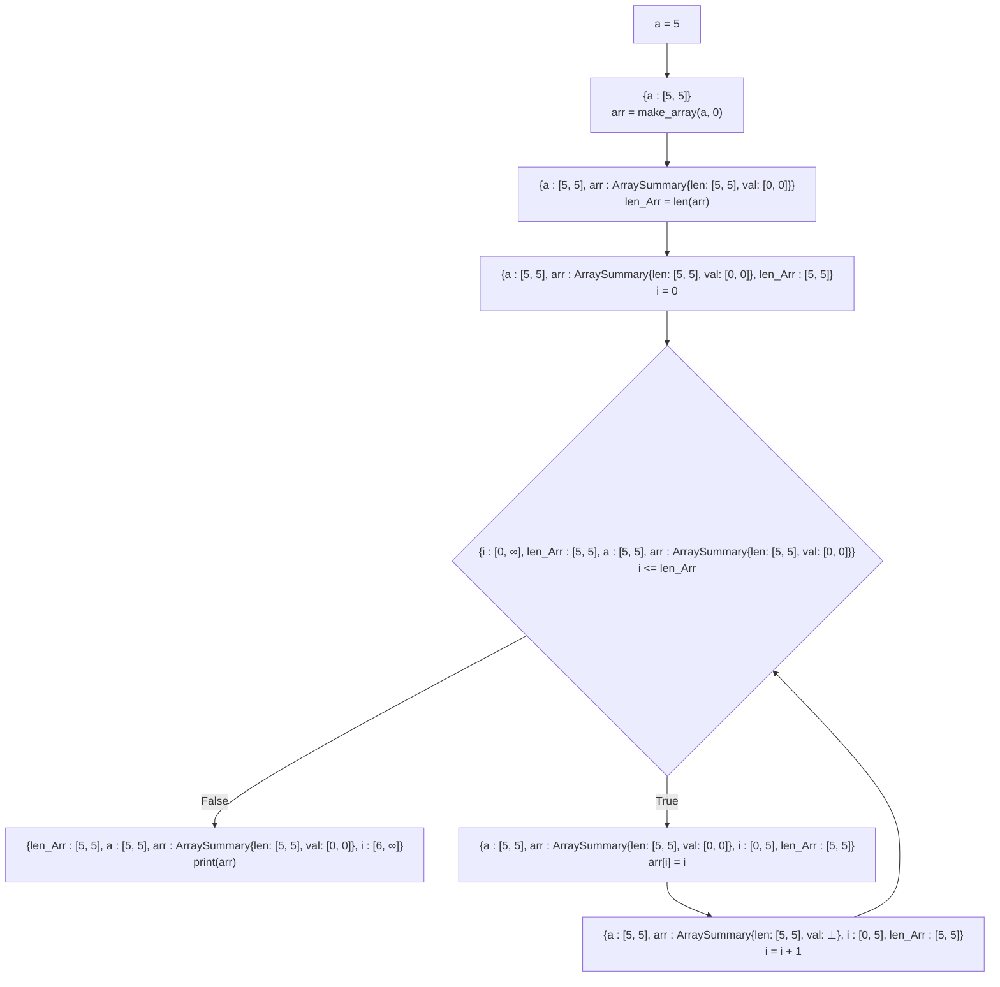

```mermaid
---
config:
    "markdownAutoWrap": false
---
flowchart TD
6["`{a : [5, 5], arr : ArraySummary{len: [5, 5], val: [0, 0]}}
len_Arr = len(arr)`"]

7["`{a : [5, 5]}
arr = make_array(a, 0)`"]

8["`a = 5`"]

1["`{len_Arr : [5, 5], a : [5, 5], arr : ArraySummary{len: [5, 5], val: [0, 0]}, i : [6, ∞]}
print(arr)`"]

2{"`{i : [0, ∞], len_Arr : [5, 5], a : [5, 5], arr : ArraySummary{len: [5, 5], val: [0, 0]}}
i <= len_Arr`"}

3["`{a : [5, 5], arr : ArraySummary{len: [5, 5], val: ⊥}, i : [0, 5], len_Arr : [5, 5]}
i = i + 1`"]

4["`{a : [5, 5], arr : ArraySummary{len: [5, 5], val: [0, 0]}, i : [0, 5], len_Arr : [5, 5]}
arr[i] = i`"]

5["`{a : [5, 5], arr : ArraySummary{len: [5, 5], val: [0, 0]}, len_Arr : [5, 5]}
i = 0`"]

7 --> 6
8 --> 7
3 --> 2
4 --> 3
2 -- True --> 4
2 -- False --> 1
5 --> 2
6 --> 5
```