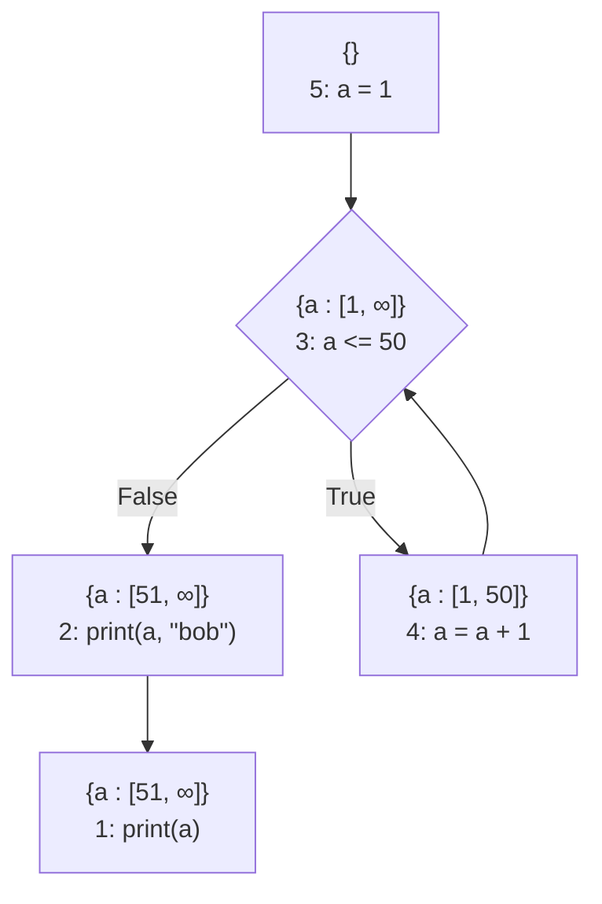

```mermaid
---
config:
    "markdownAutoWrap": false
---
flowchart TD
4["`{a : [1, 50]}
4: a = a + 1`"]

5["`{}
5: a = 1`"]

1["`{a : [51, ∞]}
1: print(a)`"]

2["`{a : [51, ∞]}
2: print(a, #34;bob#34;)`"]

3{"`{a : [1, ∞]}
3: a <= 50`"}

2 --> 1
4 --> 3
3 -- True --> 4
3 -- False --> 2
5 --> 3
```