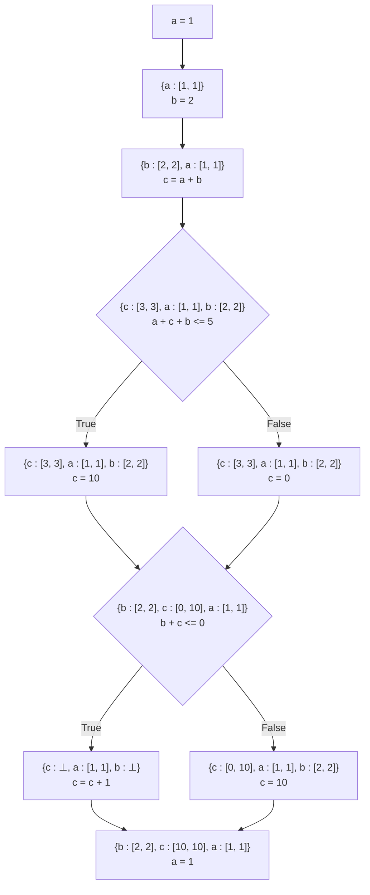

```mermaid
---
config:
    "markdownAutoWrap": false
---
flowchart TD
3["`{c : ⊥, a : [1, 1], b : ⊥}
c = c + 1`"]

4["`{c : [0, 10], a : [1, 1], b : [2, 2]}
c = 10`"]

6["`{c : [3, 3], a : [1, 1], b : [2, 2]}
c = 10`"]

7["`{c : [3, 3], a : [1, 1], b : [2, 2]}
c = 0`"]

8["`{b : [2, 2], a : [1, 1]}
c = a + b`"]

2{"`{b : [2, 2], c : [0, 10], a : [1, 1]}
b + c <= 0`"}

5{"`{c : [3, 3], a : [1, 1], b : [2, 2]}
a + c + b <= 5`"}

9["`{a : [1, 1]}
b = 2`"]

10["`a = 1`"]

1["`{b : [2, 2], c : [10, 10], a : [1, 1]}
a = 1`"]

3 --> 1
4 --> 1
2 -- True --> 3
2 -- False --> 4
6 --> 2
5 -- True --> 6
5 -- False --> 7
7 --> 2
8 --> 5
9 --> 8
10 --> 9
```